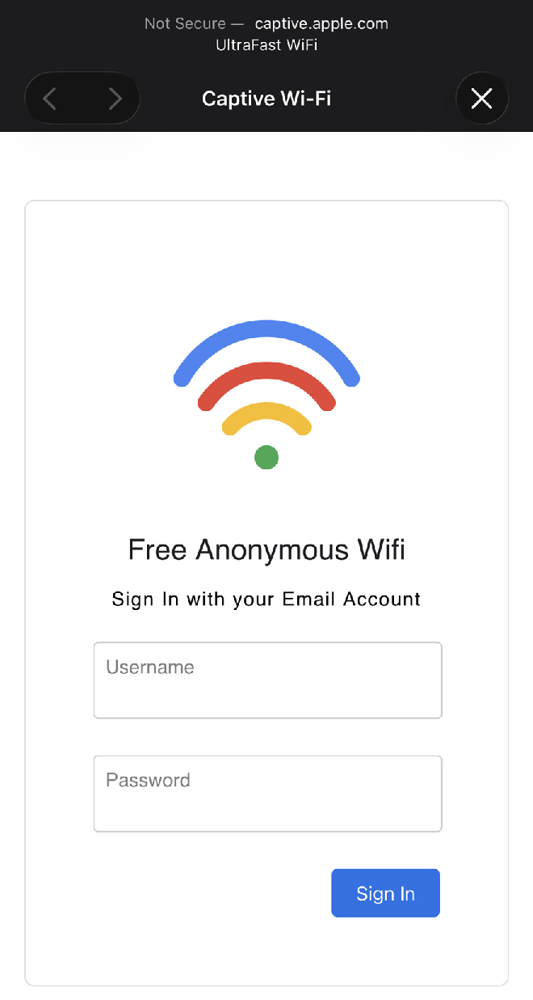
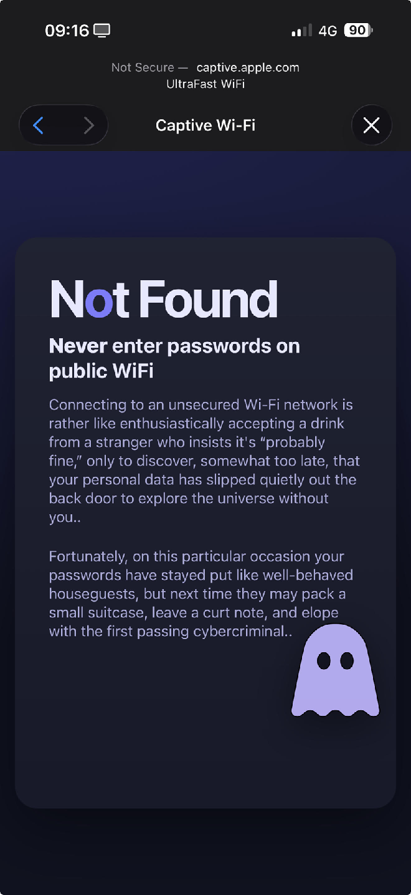

# ESP32 Public Wi-Fi Awareness Portal

An educational project using an ESP32 to simulate an open public Wi-Fi network with a captive portal. The goal is to demonstrate how easy it is to present a convincing login page, and to remind users never to enter sensitive credentials on unsecured networks.

## Purpose

This project is strictly for educational and awareness purposes.  
It shows how attackers can mimic legitimate login portals on public Wi-Fi.

No credentials are stored, logged, or transmitted at any point.

## How It Works

1. The ESP32 creates an open Wi-Fi network.
2. When a user connects, they are redirected to a captive portal.
3. The portal presents a fake login page.
4. After interaction, the user is shown a message explaining:
   - This was a simulation
   - The risks of entering credentials on public Wi-Fi
   - Best practices for staying safe

## What Users Learn

- Public Wi-Fi networks are not inherently trustworthy
- Login pages can be spoofed easily
- Sensitive information should never be entered on unknown networks
- Always verify network legitimacy before interacting

## Privacy and Ethics

- No data is collected
- No credentials are stored
- No external servers are contacted
- Everything runs locally on the ESP32

This project is designed to educate, not deceive.

## Hardware Requirements

- ESP32 development board
- USB cable for programming

## Software Requirements

- Arduino IDE or PlatformIO
- ESP32 board support package

